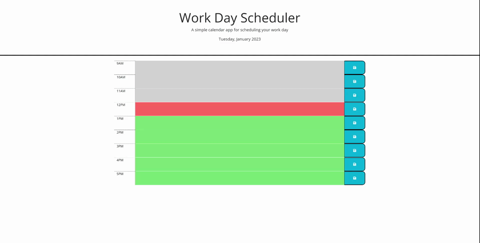
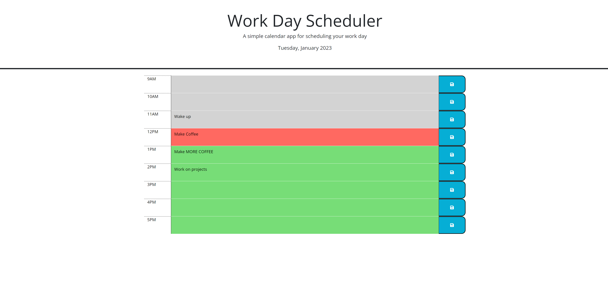

# Plan Ahead
Work Day Scheduler 

# Description
With how busy life can be, sometimes you just need to be able to make a list of all the tasks for the day. With this scheduler, your day is easily recorded in real time. This scheduler is color coded based on the time of day. Current time slots will be highlighted red. Past time slots will be highlighted grey. The future time slots will be green. These will change as the day goes on. Each block contains a text area, which also includes a save button on the far right side. This will be stored in your local storage, as well as staying on the page after it has been refreshed. The only way to remove the task is by deleting, and writing a new task in that slot. 

# Screenshot

# Links 

Github : https://github.com/GrindBoiWes/plan-ahead

Website : https://grindboiwes.github.io/plan-ahead/

# Credits
Credits include various stack overflow articles, codeburst, and fellow students who are apart of a small study group. 
